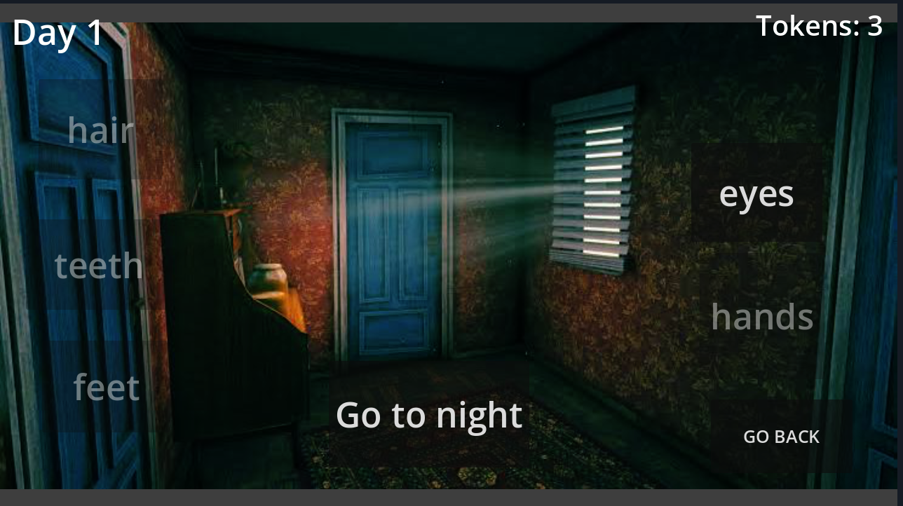

# CS240 Zombie Survival Game  
*A Godot + C++ Interactive Study Game*

## 👥 Team Members
- Alberto Alvarez Alcaraz  
- Jose Sanchez Menchen  
- Mikel Sabina Bazaco  
- Adi Karamustafic  


---

## 🎯 Project Purpose and Description
Many students struggle to find effective and engaging ways to prepare for computer science exams. This project addresses that problem by transforming CMSC240-style practice questions into a survival game.

Players face a zombie apocalypse, and the only way to survive each day is by correctly answering C++ and computer science-related questions. Good answers grant tokens which come in handy in order to defeat the zombies, while mistakes put the player’s chances of survival at risk.

**Core features include:**
- Three difficulty levels (easy, medium, hard)  
- Reward mechanics for correct answers  
- CMSC-themed trivia and problem-solving questions  
- Day-counter survival system  
- Personalized portraits for every character  
- Godot engine environment with C++ integration  

The concept is inspired by *No, I’m Not a Human* by Trioskaz, adapting its decision-and-survival structure into an educational setting.

---

## 📦 External Libraries and Installation Instructions

This project uses **Godot with GDExtension C++ integration**. To build and run the C++ part of the project, you will need:

### Required tools
- **Godot Engine 4.x**  
- **C++ compiler**  
- **Godot-cpp bindings** (GDExtension)  

### Setup steps
1. Clone or download the project.  
2. Install Godot 4.x (from the official website).  
3. Navigate to the folder containing the C++ extension.   
4. Build the bindings:  
   ```bash
   scons platform=windows or linux / macos
   ```
7. Build the extension library using CMake or SCons (depending on your project's build setup).  


---

## 🛠️ How to Compile and Run

### Run inside Godot
1. Open Godot.  
2. Load the project folder.  
3. Make sure the built native library is correctly referenced in the GDExtension config file.  
4. Press **Play** in the Godot editor to launch the game.

---

## ▶️ Example Usage

Once the game starts:

1. You get some introductory instructions.
2. Choose a difficulty level.
3. Each day, a resident knocks on your door. Let them in or reject them.
4. Go to sleep.
5. Wake up and watch the news to get a clue about the zombies.
6. Do the CMSC240 quiz. Answer questions correctly to earn tokens. Inspect character features to decide: human or zombie? Or just go to sleep, but remember, your choices determine who survives the night.
7. Night outcomes resolved.


---

## 🖼️ Screenshots

**Screenshot 1:**  


**Screenshot 2:**  
  

**Screenshot 3:**  
  

**Screenshot 4:**  
  

**Screenshot 5:**  
  

**Screenshot 6:**  
  

**Screenshot 7:**  
  

**Screenshot 8:**  
  

---

## 🤖 AI Tools Used

AI assistance was used during:
- Godot procedures
- Scene structures
- Godot Commands
- UI.gd process


